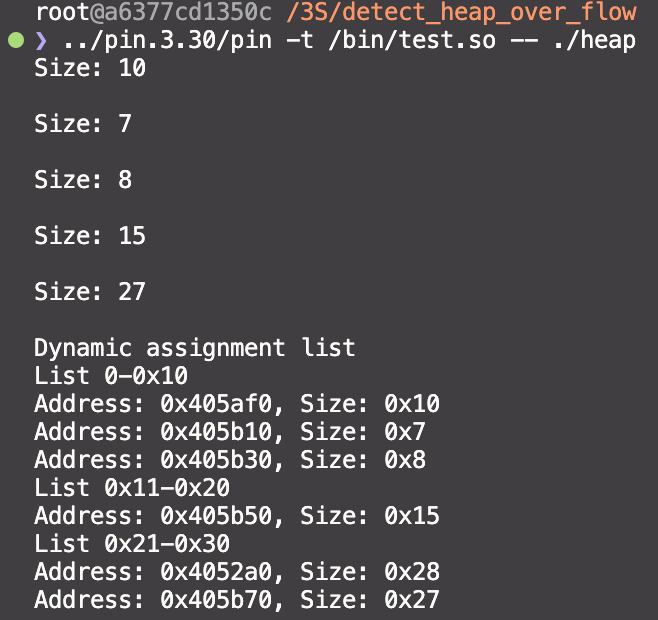

**이번엔 pin tool을 이용하여 동적으로 할당 (해당 구현에서는 malloc만) 되는 메모리들에 대해 사이즈와 주소들을 관리해주는 후킹 함수를 pin tool 을 통해 구현해보고자 한다.**

<br />

## **RTN**

RTN은 일반적으로 C와 같은 절차적 프로그래밍 언어용 컴파일러에서 생성되는 함수/루틴/프로시저를 나타낸다. Pin은 기호 테이블 정보를 사용하여 루틴을 찾는다. 기호 테이블 정보를 사용할 수 있도록 **[PIN_InitSymbols()](https://software.intel.com/sites/landingpage/pintool/docs/98830/Pin/doc/html/group__PIN__CONTROL.html#ga5a74f4530db5d94bede1391c59e39939)** 를 호출해야 한다. 계측시간 및 분석시간에 접근 가능하다.

(intel pin tool manual)

<br />

--- 

## **구조체를 이용하여 size 0~0x30까지만 관리하는 간단한 구현**

### 전체 code

```cpp
#include "pin.H"
#include <iostream>

using namespace std;

#if defined(TARGET_MAC)
#define MALLOC "_malloc"
#define FREE "_free"
#else
#define MALLOC "malloc"
#define FREE "free"
#endif

typedef struct Node {
    struct Node *next;
    ADDRINT size;
    ADDRINT addr;
} Node;

typedef struct List {
    Node *header;
} List;

List list_0_10 = {nullptr};
List list_11_20 = {nullptr};
List list_21_30 = {nullptr};

ADDRINT SIZE;

VOID AddNode (List *L, ADDRINT size, ADDRINT addr)
{
    Node *newnode = new Node();
    newnode->size = size;
    newnode->addr = addr;
    newnode->next = nullptr;

    if (L->header == nullptr) 
        L->header = newnode;
    else 
    {
        Node *temp = L->header;
        while (temp->next)
            temp = temp->next;
        temp->next = newnode;
    }
}

List *GetList(ADDRINT size)
{
    if (size <= 0x10)
        return &list_0_10;
    else if (size <= 0x20)
        return &list_11_20;
    else if (size <= 0x30)
        return &list_21_30;
    return nullptr;
}

VOID Arg1Before(ADDRINT size)
{
    SIZE = size;
}

VOID MallocAfter(ADDRINT ret)
{
    List *L = GetList(SIZE);
    if (L)
        AddNode(L, SIZE, ret);
}

VOID Image(IMG img, VOID *v)
{
    RTN mallocRtn = RTN_FindByName(img, MALLOC);
    if (RTN_Valid(mallocRtn))
    {
        RTN_Open(mallocRtn);
        RTN_InsertCall(mallocRtn, IPOINT_BEFORE, (AFUNPTR)Arg1Before, IARG_FUNCARG_ENTRYPOINT_VALUE, 0, IARG_END);
        RTN_InsertCall(mallocRtn, IPOINT_AFTER, (AFUNPTR)MallocAfter, IARG_FUNCRET_EXITPOINT_VALUE, IARG_END);
        RTN_Close(mallocRtn);
    }
}

VOID PrintList(List *list, const char * listName)
{
    cout << listName << endl;
    Node *current = list->header;
    while (current)
    {
        cout << "Address: " << current->addr << ", Size: " << current->size << endl;
        current = current->next;
    }
}

VOID Fini(INT32 code, VOID *v)
{
    cout << "Dynamic assignment list" << endl;
    PrintList(&list_0_10, "List 0-0x10");
    PrintList(&list_11_20, "List 0x11-0x20");
    PrintList(&list_21_30, "List 0x21-0x30");
}

int main(int argc, char *argv[])
{
    PIN_InitSymbols();
    PIN_Init(argc, argv);

    cout << hex << showbase;
    IMG_AddInstrumentFunction(Image, 0);
    PIN_AddFiniFunction(Fini, 0);

    PIN_StartProgram();
    return 0;
}
```

### 전처리기

```cpp
#if defined(TARGET_MAC)
#define MALLOC "_malloc"
#define FREE "_free"
#else
#define MALLOC "malloc"
#define FREE "free"
#endif
```

Linux/Windows와 Mac os에선 함수명이 다르기 때문에 조건부 컴파일을 넣어줌.

### Image Function

```cpp
VOID Image(IMG img, VOID *v)
{
    RTN mallocRtn = RTN_FindByName(img, MALLOC);
    if (RTN_Valid(mallocRtn))
    {
        RTN_Open(mallocRtn);
        RTN_InsertCall(mallocRtn, IPOINT_BEFORE, (AFUNPTR)Arg1Before, IARG_FUNCARG_ENTRYPOINT_VALUE, 0, IARG_END);
        RTN_InsertCall(mallocRtn, IPOINT_AFTER, (AFUNPTR)MallocAfter, IARG_FUNCRET_EXITPOINT_VALUE, IARG_END);
        RTN_Close(mallocRtn);
    }
}
```

1. `IARG_FUNCARG_ENTRYPOINT_VALUE`
   
   후킹된 함수의 인수(argument)값을 가져온다.
   
   가져올 인수를 지정할 수 있는데, 첫 번째 인수는 `IARG_FUNCARG_ENTRYPOINT_VALUE, 0` ****로 시작하여 뒤의 숫자에 따라 가져오는 인수의 위치가 달라진다.

2. `IARG_FUNCRET_EXITPOINT_VALUE`
   
   후킹된 함수의 return 값을 가져온다. 함수가 마친 후 반환될 때 가져올 수 있기 때문에 `IPOINT_AFTER` 를 이용해주어야 한다.

### List

```cpp
typedef struct Node {
    struct Node *next;
    ADDRINT size;
    ADDRINT addr;
} Node;

typedef struct List {
    Node *header;
} List;

List list_0_10 = {nullptr};
List list_11_20 = {nullptr};
List list_21_30 = {nullptr};
```

리스트를 이용해 노드들을 사이즈 별로 관리해줌.

### 시행착오

```cpp
ADDRINT SIZE;
```

원래는 MalloAfter함수에서 size도 같이 가져와서 처리를 해주려고 했는데 되지 않음(IPOINT AFTER라 그런가). 때문에 Before함수를 만들어서 전역변수로 지정한 SIZE 변수에 malloc의 사이즈를 저장하도록 구현해줌.

<br />

---

## **실제 구현**

### 계측 할 Source Code

```c
#include <stdio.h>
#include <string.h>
#include <stdlib.h>
int main()
{
        int size;
    char **ptr;

        ptr = (char **)malloc(sizeof(char *) * 5);
        for (int i = 0; i < 5; i++)
        {
                printf("Size: ");
                scanf("%x", &size);
                printf("\\n");
                ptr[i] = (char *)malloc(sizeof(char)*size);
        }

    return 0;
}
```

간단한 테스트를 위해 입력한 16진수 만큼의 크기를 5번 할당해주는 코드를 작성함.

### 실행


해당 소스 코드를 보호 기법을 다 해제되도록 컴파일 해준 후 실행시켜보자.

{: width="500px"}

각 size별로 실제 할당된 사이즈와 주소가 구분되어 출력되는 것을 확인할 수 있다.

다음엔 실시간으로 할당되는 것들을 모아주고, free해주면 목록에서 삭제하고 프로그램 종료 시 free되지 않은 목록들을 출력하도록 tool을 발전시켜 보아야겠다.
